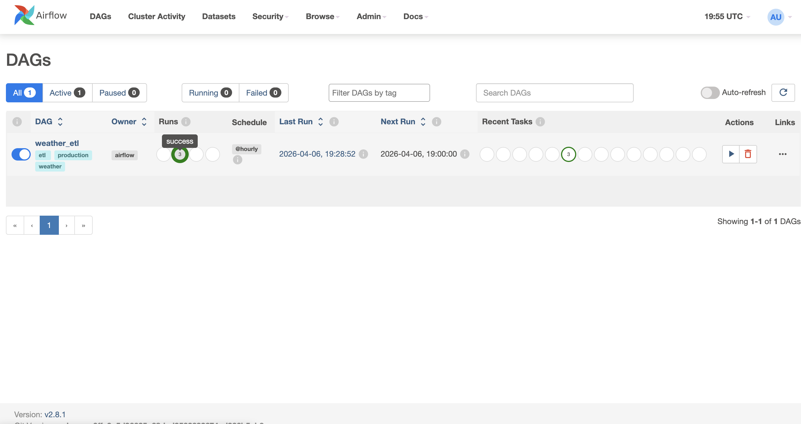
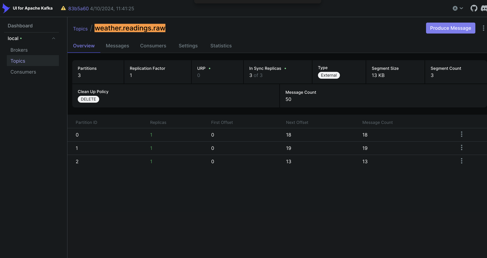
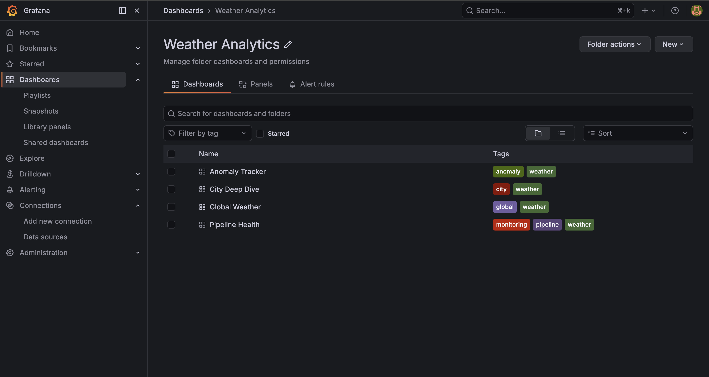
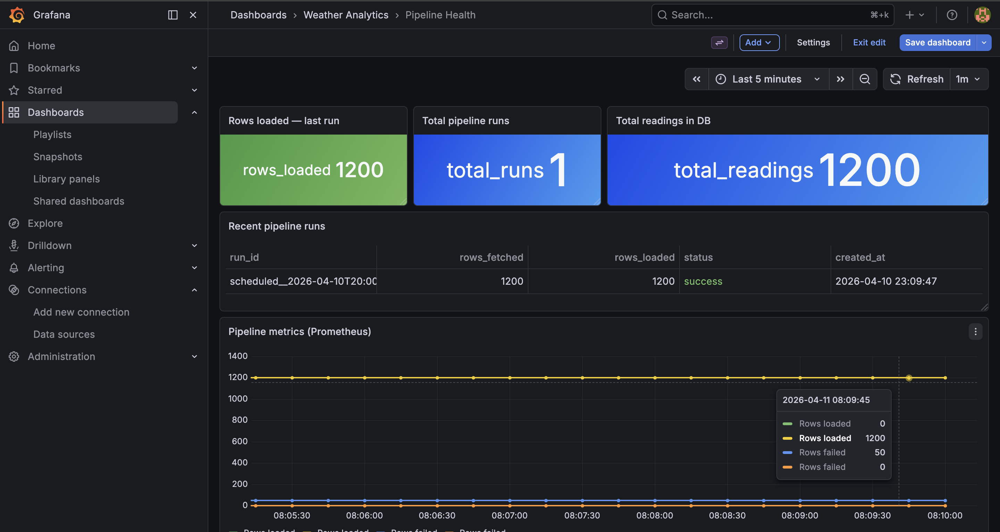
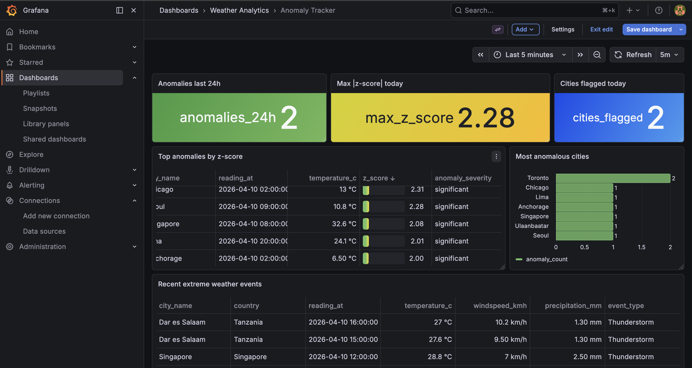
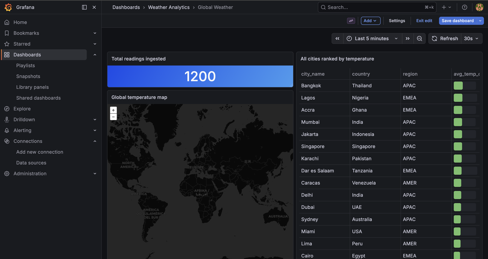

<div align="center">

<br/>

```
██╗    ██╗███████╗ █████╗ ████████╗██╗  ██╗███████╗██████╗
██║    ██║██╔════╝██╔══██╗╚══██╔══╝██║  ██║██╔════╝██╔══██╗
██║ █╗ ██║█████╗  ███████║   ██║   ███████║█████╗  ██████╔╝
██║███╗██║██╔══╝  ██╔══██║   ██║   ██╔══██║██╔══╝  ██╔══██╗
╚███╔███╔╝███████╗██║  ██║   ██║   ██║  ██║███████╗██║  ██║
 ╚══╝╚══╝ ╚══════╝╚═╝  ╚═╝   ╚═╝   ╚═╝  ╚═╝╚══════╝╚═╝  ╚═╝
```

### **Global Weather Analytics Platform**
*Production-grade data engineering — batch, streaming, analytics, and observability.*
*50 cities · 6 continents · 16 services · $0 cloud spend.*

<br/>

[](https://airflow.apache.org)
[](https://kafka.apache.org)
[](https://getdbt.com)
[](https://postgresql.org)
[](https://grafana.com)
[](https://min.io)
[](https://python.org)
[](https://docker.com)

<br/>

</div>

---

## 🖼️ Platform in Action

<br/>

<!-- Hero screenshot -->
<div align="center">
  
</div>

<br/><br/>

<!-- Two dashboards side by side -->
<div align="center">
  
  
</div>

<br/><br/>

<!-- Airflow + Kafka -->
<div align="center">
  
  
</div>

<br/><br/>

<!-- Pipeline health -->
<div align="center">
  
</div>

<br/>
---

## 📐 Architecture

```
                        ┌─────────────────────────────────────┐
                        │         Open-Meteo API               │
                        │   (free · no key · 80yr history)    │
                        └──────────────┬──────────────────────┘
                                       │
               ┌───────────────────────┼───────────────────────┐
               │                       │                       │
               ▼                       ▼                       │
   ┌─────────────────────┐  ┌─────────────────────┐           │
   │   BATCH LAYER       │  │  STREAMING LAYER     │           │
   │   Airflow @hourly   │  │  Kafka every 5 min   │           │
   │                     │  │                      │           │
   │  fetch_and_stage    │  │  Producer            │           │
   │       │             │  │    ├─ readings.raw   │           │
   │       ▼             │  │    └─ alerts (z>2σ)  │           │
   │    MinIO            │  │         │            │           │
   │  (raw JSON,         │  │         ▼            │           │
   │   partitioned)      │  │     Consumer         │           │
   │       │             │  │  (batch 100, manual  │           │
   │       ▼             │  │   commit offset)     │           │
   │  load_to_postgres   │  └────────┬─────────────┘           │
   │       │             │           │                         │
   │       ▼             │           ▼                         │
   │  validate_data      │    streaming_readings               │
   │  + DQ checks        │                                     │
   └────────┬────────────┘                                     │
            │                                                  │
            ▼                                                  │
   ┌─────────────────────────────────────────────────────────┐ │
   │                  PostgreSQL                             │ │
   │              weather schema                             │◄┘
   └─────────────────────────┬───────────────────────────────┘
                             │
                             ▼
   ┌─────────────────────────────────────────────────────────┐
   │                    dbt Core 1.7                         │
   │                                                         │
   │  staging views    ──▶   mart tables                     │
   │  stg_weather_readings   daily_summary                   │
   │  stg_cities             weekly_trends                   │
   │                         city_comparisons                │
   │                         temperature_anomalies  ◄ z-score│
   │                         extreme_weather                 │
   └─────────────────────────┬───────────────────────────────┘
                             │
                             ▼
   ┌─────────────────────────────────────────────────────────┐
   │                    Grafana                              │
   │                                                         │
   │  🗺  Global Geomap      📊 City Deep Dive               │
   │  🔔 Anomaly Tracker     🩺 Pipeline Health              │
   └─────────────────────────────────────────────────────────┘

   ┌─────────────────────────────────────────────────────────┐
   │            Prometheus + Pushgateway                     │
   │     pipeline metrics · DQ SLOs · row counts            │
   └─────────────────────────────────────────────────────────┘
```

---

## ⚡ Quick Start

```bash
git clone https://github.com/YOUR_USERNAME/weather-analytics-platform
cd weather-analytics-platform
cp .env.example .env
docker compose up -d
```

> Wait ~90 seconds for all 16 services to initialize.
> Then **manually trigger** the `weather_etl` DAG in Airflow to populate the database immediately — don't wait for the hourly schedule.

<br/>

| Service | URL | Login |
|:---|:---|:---|
| 🌀 **Airflow** | http://localhost:8080 | `admin` / `admin` |
| 📊 **Grafana** | http://localhost:3000 | `admin` / `admin` |
| 🪣 **MinIO Console** | http://localhost:9001 | `minioadmin` / `minioadmin` |
| 📨 **Kafka UI** | http://localhost:8090 | — |
| 📈 **Prometheus** | http://localhost:9090 | — |

<br/>

Run dbt after at least one DAG run completes:

```bash
cd dbt
dbt run    # builds all 5 mart tables
dbt test   # runs all schema tests
```

Run the test suite:

```bash
# Unit tests — no DB required
pip install pytest psycopg2-binary
pytest tests/test_etl.py -v

# Integration tests — requires running DB + dbt run
POSTGRES_HOST=localhost POSTGRES_PORT=5433 pytest tests/test_dbt_models.py -v
```

---

## 🏗️ What This Platform Does

### Batch Pipeline · Airflow

An hourly DAG with three tasks:

```
fetch_and_stage  ──▶  load_to_postgres  ──▶  validate_data
```

- **`fetch_and_stage`** — Calls Open-Meteo for 50 cities, stores raw JSON in MinIO using Hive-style partition paths (`city=/year=/month=/day=/hour=`). Pushes only lightweight XCom metadata (not payloads) to stay within Airflow limits.
- **`load_to_postgres`** — Reads each file from MinIO and inserts all 6 weather columns with `ON CONFLICT DO UPDATE` — fully idempotent, safe to retry infinitely without producing duplicates.
- **`validate_data`** — Three automated data quality checks: city coverage ≥ 45/50, zero null temperatures, zero readings outside −90°C to 60°C.

All three tasks push metrics to **Prometheus Pushgateway**, visible in the Pipeline Health dashboard.

<br/>

### Streaming Pipeline · Kafka

```
Producer (every 5 min)
    ├──▶  weather.readings.raw   (all 50 cities, current conditions)
    └──▶  weather.alerts         (fired when temp > 2σ from 30-day baseline)
              │
              ▼
         Consumer
    (batch=100, enable.auto.commit=False, manual commit)
              │
              ▼
    streaming_readings (PostgreSQL)
```

The producer loads 30-day rolling baselines from PostgreSQL on every cycle. If a city's current temperature is more than two standard deviations from its historical mean, an alert message is produced to the `weather.alerts` topic with the z-score and severity attached.

<br/>

### Analytics Layer · dbt

Five mart models, all materialized as tables with schema tests:

| Model | Description |
|:---|:---|
| `daily_summary` | Min/max/avg temperature, total precipitation, dominant weather condition — one row per city per day |
| `weekly_trends` | 7-day rolling average temperature using `ROWS BETWEEN 6 PRECEDING AND CURRENT ROW` |
| `city_comparisons` | All-time aggregates with lat/lon — powers the Grafana geomap |
| `temperature_anomalies` | 30-day rolling z-score + IQR-based robust z-score per city, per reading |
| `extreme_weather` | Heatwaves, freezes, storms, high-wind events — all-time history |

dbt materialization strategy: `view` for staging (no storage cost), `ephemeral` for intermediates (compiled as CTEs), `table` for marts (fast dashboard queries).

<br/>

### Dashboards · Grafana (provisioned as code)

All four dashboards are committed as JSON and provisioned automatically on container start — no manual setup required after cloning.

| Dashboard | Key panels |
|:---|:---|
| 🗺 **Global Weather** | Geomap colored by avg temperature · City ranking table |
| 📊 **City Deep Dive** | Interactive `$city` dropdown · Daily temperature range · Precipitation bar chart |
| 🔔 **Anomaly Tracker** | Z-score gauge table · Most anomalous cities bar chart · Extreme weather events |
| 🩺 **Pipeline Health** | Rows loaded per run · City coverage stat · Recent runs table (color-coded) · Prometheus timeseries |

---

## 🛠️ Tech Stack & Why

| Layer | Tool | Why this, not the alternative |
|:---|:---|:---|
| Orchestration | **Apache Airflow 2.8** | Industry standard; CeleryExecutor mirrors real production setups |
| Streaming | **Apache Kafka 3.5** | Durable, partitioned, replayable — RabbitMQ deletes messages on consume |
| Object storage | **MinIO** | S3-compatible API; swappable to AWS S3 with zero code changes |
| Warehouse | **PostgreSQL 15** | Composite PK, partial indexes, window functions, no extra infra |
| Transformation | **dbt Core 1.7** | Lineage graph, column-level tests, ephemeral intermediates |
| Dashboards | **Grafana** | Provisioned-as-code JSON; reproducible with no clicks |
| Monitoring | **Prometheus + Pushgateway** | Pull-based metrics; pipeline health SLOs |
| Data source | **Open-Meteo API** | Free, no API key, no rate limits — OpenWeatherMap free tier caps at 1,000 calls/day; this pipeline needs 1,200 |

See [`docs/adr/`](docs/adr/) for full Architecture Decision Records with alternatives considered.

---

## 🔑 Key Engineering Decisions

**Idempotent loading**
Every INSERT uses `ON CONFLICT (city_id, timestamp) DO UPDATE SET ...`. The DAG is safe to rerun at any time — Airflow's retry mechanism will never produce duplicate rows.

**Exactly-once Kafka delivery**
The producer is configured with `acks=all` + `enable.idempotence=True` + `compression.type=snappy`. This combination prevents message loss on broker restart and eliminates silent duplicates without requiring transactions.

**Manual consumer commit**
`enable.auto.commit=False` with `consumer.commit(asynchronous=False)` after every flushed batch of 100. If the consumer crashes mid-batch, it replays from the last committed offset — no silent data loss.

**Two anomaly scoring methods**
`temperature_anomalies` computes both a standard z-score and an IQR-based robust z-score. Standard z-scores are distorted when a single extreme reading inflates the standard deviation — the IQR-based score is unaffected by outliers and catches subsequent anomalies that the z-score would miss.

**Minimum sample guard**
The anomaly mart requires `HAVING COUNT(*) >= 24` (one full day of hourly readings) before computing statistics. This prevents meaningless z-scores on pipeline startup when only a few readings exist per city.

**XCom size discipline**
`fetch_and_stage` pushes only lightweight metadata per city (`{city_id, name, s3_key}`) rather than the full API JSON. `load_to_postgres` reads the actual data from MinIO using the key. This keeps Airflow's metadata database from bloating.

---

## 🛡️ Data Quality

Three automated checks run after every hourly load:

| # | Check | Pass condition | What it catches |
|:---|:---|:---|:---|
| 1 | City coverage | ≥ 45 / 50 cities in last 2h | API failures, network timeouts |
| 2 | Null temperatures | 0 null rows in last 2h | Missing API fields |
| 3 | Extreme values | All temps between −90°C and 60°C | API data corruption |

dbt schema tests run separately and cover `not_null`, `unique`, `accepted_values`, and range checks on every mart model column.

---

## 📁 Project Structure

```
weather-analytics-platform/
│
├── 📋 docker-compose.yml          — All 16 services, one command
├── 📋 .env.example                — Copy to .env, no values to change
│
├── 🌀 airflow/
│   ├── dags/
│   │   ├── weather_etl_dag.py     — Hourly batch ETL (3 tasks)
│   │   └── kafka_producer_dag.py  — Streaming freshness monitor
│   └── requirements.txt
│
├── 📨 kafka/
│   ├── producer.py                — 5-min poll, z-score alerts, idempotent delivery
│   └── consumer.py                — Batch insert, manual offset commit
│
├── 🔶 dbt/
│   └── models/
│       ├── staging/               — Views: clean + validate raw data
│       │   ├── stg_weather_readings.sql
│       │   ├── stg_cities.sql
│       │   └── schema.yml         — Column-level tests
│       └── marts/                 — Tables: aggregated analytics
│           ├── daily_summary.sql
│           ├── weekly_trends.sql
│           ├── city_comparisons.sql
│           ├── temperature_anomalies.sql
│           ├── extreme_weather.sql
│           └── schema.yml
│
├── 📊 grafana/
│   ├── dashboards/                — 4 JSON dashboards (auto-provisioned)
│   └── datasources/               — PostgreSQL + Prometheus (auto-provisioned)
│
├── 🐘 scripts/
│   ├── init_db.sql                — Schema + indexes
│   └── seed_cities.sql            — 50 cities across 6 continents
│
├── 📈 monitoring/
│   └── prometheus.yml
│
├── 📖 docs/adr/
│   ├── 001-why-open-meteo.md
│   ├── 002-why-minio-not-s3.md
│   └── 003-why-kafka-not-rabbitmq.md
│
└── 🧪 tests/
    ├── test_etl.py                — 7 unit tests, no DB required
    └── test_dbt_models.py         — 6 integration tests against live DB
```

---

## 🐳 All 16 Services

| Container | Role |
|:---|:---|
| `postgres` | Primary data warehouse — `weather` schema |
| `redis` | Airflow Celery broker |
| `airflow-webserver` | Airflow UI on :8080 |
| `airflow-scheduler` | DAG scheduling |
| `airflow-worker` | Task execution (Celery) |
| `airflow-init` | One-time DB migration on startup |
| `zookeeper` | Kafka coordination |
| `kafka` | Message broker — `weather.readings.raw` + `weather.alerts` |
| `kafka-ui` | Topic browser on :8090 |
| `kafka-producer` | Polls Open-Meteo every 5 min, produces to Kafka |
| `kafka-consumer` | Reads from Kafka, batch-inserts to PostgreSQL |
| `minio` | S3-compatible object store on :9000 |
| `minio-init` | Creates `weather-raw` + `weather-staging` buckets |
| `prometheus` | Metrics collection on :9090 |
| `pushgateway` | Receives metrics pushed from Airflow tasks |
| `grafana` | Dashboards on :3000, fully pre-configured |

---

<div align="center">

**Built with purpose to be awesome.**

*If this project helped you, leave a ⭐ — it genuinely helps.*

</div>